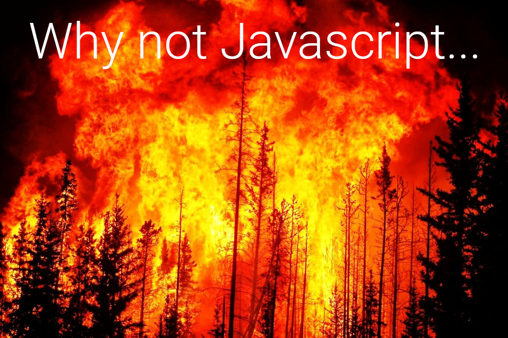

# Elm practice

## Revisiting elm...

### Elm talk video


[](https://www.youtube.com/watch?v=RFrKffrKCeU)

Long story short...



> `Uncaught TypeError: Cannot read property`

> `TypeError: ‘undefined’ is not an object (evaluating`

> `TypeError: null is not an object`

> `(unknown): Script error`

> `TypeError: Object doesn’t support property`

> `TypeError: ‘undefined’ is not a function`

> `Uncaught RangeError`

> `TypeError: Cannot read property ‘length’`

> `Uncaught TypeError: Cannot set property`

> `ReferenceError: event is not defined`

---

# OK now..


### Introduction

Elm is a domain-specific programming language for declaratively creating web browser-based graphical user interfaces. Elm is purely functional, and is developed with emphasis on usability, performance, and robustness. It advertises "no runtime exceptions in practice", made possible by the Elm compiler's static type checking.

---

#### key points taken fron the internet

- They say it just won't catch fire like the javascript forest does.

- They say it will get you fired because it allows only bug free code and the application will never have a runtime exception.

## How to start with Elm?

### Installing elm

just as easy as everything else if you used npm before: `npm install -g elm`

#### Configure Your Editor

`ext install sbrink.elm`

Then, in `.vscode/settings.json`, add the following:

    "elm.compiler": "./node_modules/.bin/elm",
    "elm.makeCommand": "./node_modules/.bin/elm-make"

### typing `elm` in the terminal..

lists useful commands for elm development..

```
$ elm
Hi, thank you for trying out Elm 0.19.0. I hope you like it!

-------------------------------------------------------------------------------
I highly recommend working through <https://guide.elm-lang.org> to get started.
It teaches many important concepts, including how to use `elm` in the terminal.
-------------------------------------------------------------------------------

The most common commands are:

    elm repl
        Open up an interactive programming session. Type in Elm expressions like
        (2 + 2) or (String.length "test") and see if they equal four!

    elm init
        Start an Elm project. It creates a starter elm.json file and provides a
        link explaining what to do from there.

    elm reactor
        Compile code with a click. It opens a file viewer in your browser, and
        when you click on an Elm file, it compiles and you see the result.

There are a bunch of other commands as well though. Here is a full list:

    elm repl    --help
    elm init    --help
    elm reactor --help
    elm make    --help
    elm install --help
    elm bump    --help
    elm diff    --help
    elm publish --help

Adding the --help flag gives a bunch of additional details about each one.

Be sure to ask on the Elm slack if you run into trouble! Folks are friendly and
happy to help out. They hang out there because it is fun, so be kind to get the
best results!


```

---

### writing code in the Elm repl

in terminal type `elm repl`

```elm
---- Elm 0.19.0 ----------------------------------------------------------------
Read <https://elm-lang.org/0.19.0/repl> to learn more: exit, help, imports, etc.
--------------------------------------------------------------------------------
>

```

Information on elm version and a link to the appears, all very helpful so far so good!

### let's try to write something..

#### Numbers

by simply adding two numbers `> 1+1`
we get `2 : number` with a type inference, amazing!

typing `1.5` gives us `1.5 : Float`

and `> 1.5 +0.5` gives us `2 : Float`

so the number `2` may look like an `int` but in elm there is no implicit type casting, meaning elm will never do implicit casts.
you are welcome to read more on [Elm Implicit Casts](https://elm-lang.org/0.19.0/implicit-casts) in the official documentation.

#### Strings

All strings are in double quotes `"a"`

```elm
> "a"
"a" : String
```

#### Char

char can be represented with single quotes 'a'

```elm
> 'a'
'a' : Char
> 

```

##### some errors trying to append `char` to a `string`

```elm
'a' ++"bb"
-- TYPE MISMATCH ----------------------------------------------------------- elm

The (++) operator cannot append this type of value:

5|   'a' ++"bb"
     ^^^
I am seeing a character of type:

    Char

But the (++) operator is only for appending List and String values. Maybe put
this value in [] to make it a list?

Hint: Only strings and lists are appendable.

```

##### concatenating strings can be done with `++` operator

```elm

> "a"++"pple"
"apple" : String
```

##### Useful error explanations from the compiler..

```elm
> "a"+"pple"
-- TYPE MISMATCH ----------------------------------------------------------- elm

I cannot do addition with String values like this one:

4|   "a"+"pple"
     ^^^
The (+) operator only works with Int and Float values.

Hint: Switch to the (++) operator to append strings!


```

#### everything in elm is made with functions...

###### defining a function..

just write a name for it `add` followed by arguments `a b` and after the `=` sign what it will do `a + b` it is so simple.

```elm
> add a b = a+b
<function> : number -> number -> number
> add 12 8
20 : number


```
